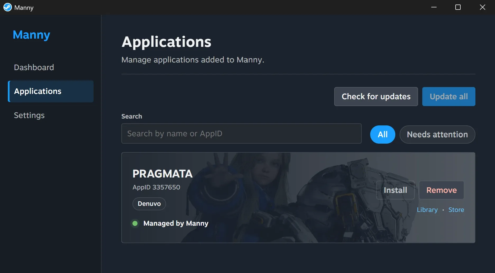

#  Manny

App Manager for Steam Desktop Client on Windows.

## Installation

1. Download the [Latest Manny Setup](../../releases/latest) and Install Manny.
2. Open `Manny → Settings` and configure everything according to your preferences.
3. Open `Steam → Store → {App Page}` and click the Manny icon to manage an app.

## Screenshots

## Disclaimer

Manny is not affiliated with, endorsed by, or sponsored by Valve or Steam.

This application is provided for research and educational purposes only.

## Security

Do not report security vulnerabilities in a public issue.

See [SECURITY.md](SECURITY.md) for reporting guidance.

## Contributing

Public contributions are currently focused on bug reports, feature requests, testing feedback, and documentation.

See [CONTRIBUTING.md](CONTRIBUTING.md).
